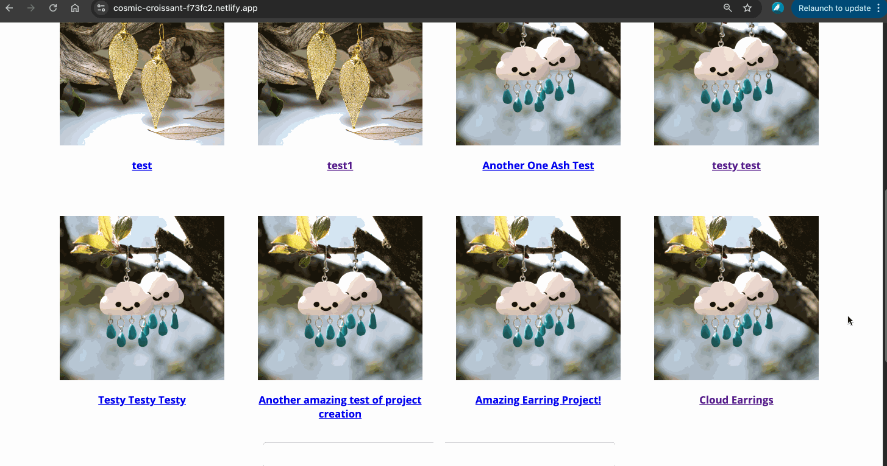
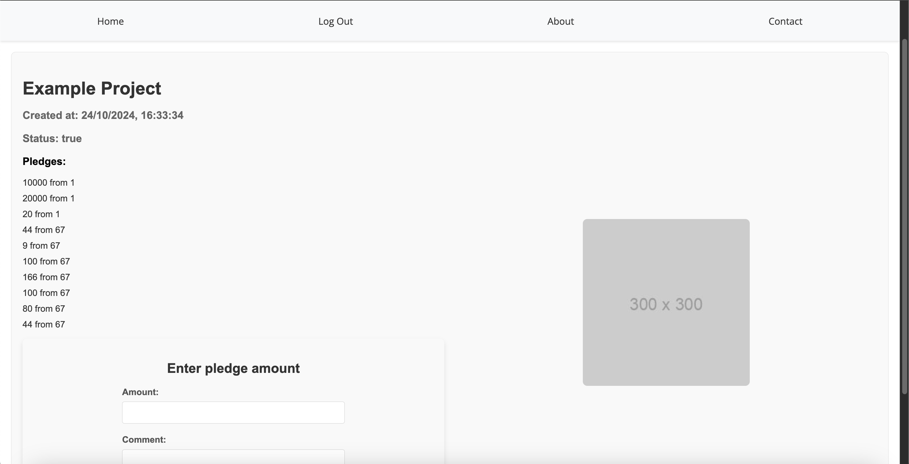
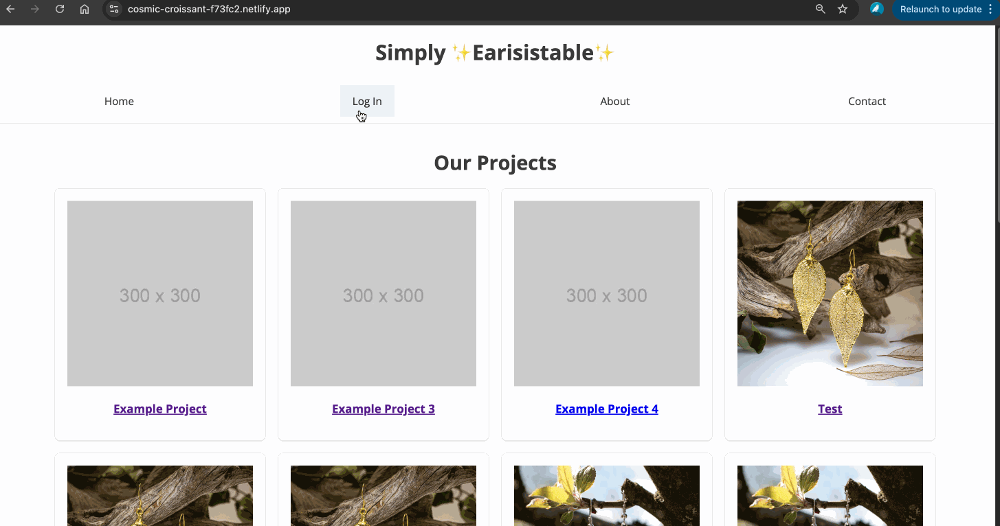
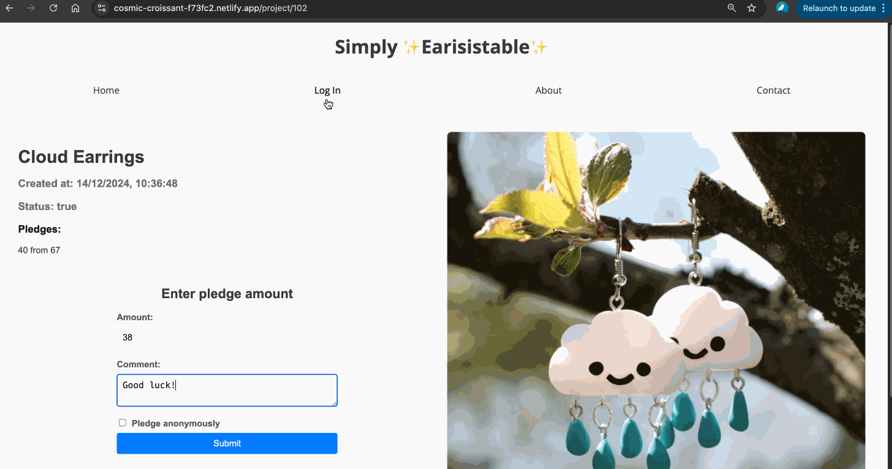

# Simply Earisistable - React Crowdfunding Frontend Project

## 🌐 Deployed Link  
A link to the deployed front-end 👉 [Please click here](https://cosmic-croissant-f73fc2.netlify.app/)

---

## 📥 Installation  

To get the app up and running locally, follow these steps:  
1. Clone this repository:  
   ```bash
   git clone https://github.com/AshleighCodes/crowdfunding_front_end.git
   ```  
2. Navigate to the project folder:  
   ```bash
   cd crowdfunding_front_end
   ```  
3. Install dependencies:  
   ```bash
   npm install
   ```  
4. Start the development server:  
   ```bash
   npm run dev
   ```  

---

## ✨ What the App Does  

This crowdfunding app allows users to:  
- Browse projects seeking funding.  
- Create their own project to showcase earring designs or DIY kits.  
- Pledge funds to support a project.  

---

## 🏆 Achievements  

- Built a fully functional front end that connects seamlessly with the back-end API.  
- Successfully integrated user authentication and project creation features.  
- Styled the interface for an intuitive and engaging user experience.  

---

## 💡 Lessons Learned  

- Deepened understanding of React and API integration.  
- Improved knowledge of user authentication and authorization flows.  
- Gained experience in deploying a front-end project using Netlify.

---

## 🚀 Future Improvements  

Here are some planned enhancements for the app:  
- Improve the styling and user experience of the login page.  
- Add 'update' and 'delete' functionality for managing projects.  
- Enhance error handling and provide clearer feedback for users during authentication and project creation.  
- Implement search and filter features to help users browse projects more efficiently.  

---

## 📸 Screenshots  

### Homepage  


### Project Creation Page  


### Pledge Creation Form  


### Project with Pledges  


### Unauthorized User Attempt to Create Project
 

### Unauthorized User Attempt to make a Pledge
 

---  

## 📂 Repository  

Check out the full code here: [GitHub Repo](https://github.com/AshleighCodes/crowdfunding_front_end)  
